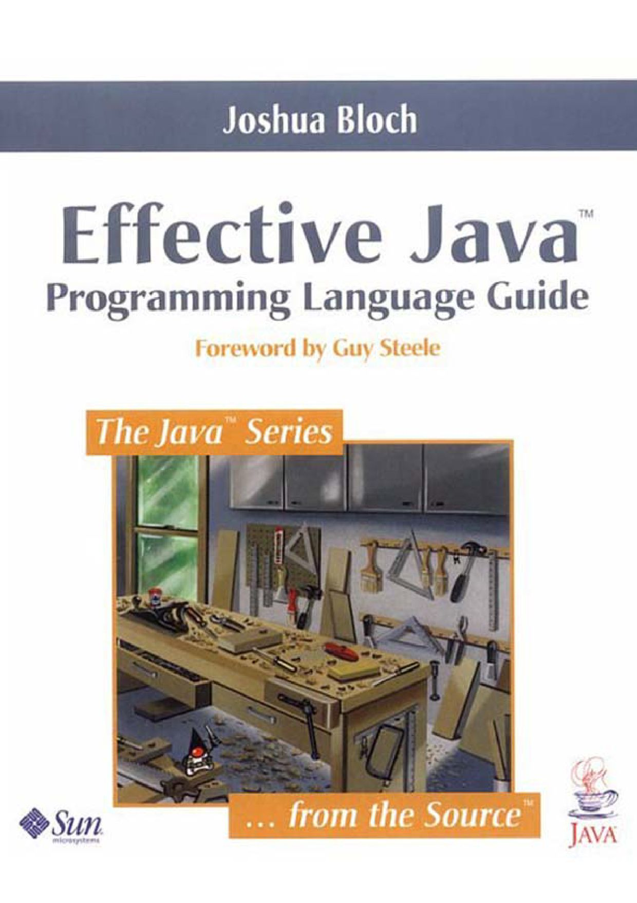
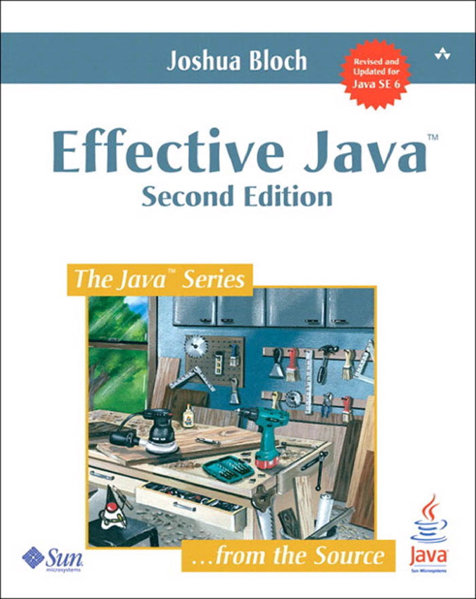

# Effective Java

[](ej-e1.md)
[](ej-e2.md)
[](ej-e3.md)

## Summary

### Chapter 2: Creating and Destroying Objects

```
Item: Consider static factory methods instead of constructors
Item: Consider a builder when faced with many constructor parameters 
Item: Enforce noninstantiability with a private constructor
Item: Avoid creating duplicate objects
Item: Enforce the singleton property with a private constructor or an enum type 
Item: Avoid creating unnecessary objects 
Item: Prefer dependency injection to hardwiring resources 
Item: Prefer try-with-resources to try-finally
```

### Chapter 3: Methods Common to All Objects

```
Item: Obey the general contract when overriding equals
Item: Always override hashCode when you override equals
Item: Always override toString
Item: Override clone judiciously
Item: Consider implementing Comparable
```

### Chapter 4: Classes and Interfaces

```
Item: Minimize the accessibility of classes and members
Item: Favor immutability
Item: Favor composition over inheritance
Item: Design and document for inheritance or else prohibit it
Item: Prefer interfaces to abstract classes
Item: Use interfaces only to define types
Item: Favor static member classes over nonstatic
Item: In public classes, use accessor methods, not public fields
Item: Minimize mutability 
Item: Prefer class hierarchies to tagged classes 
Item: Use function objects to represent strategies 
Item: Favor static member classes over nonstatic
Item: Design interfaces for posterity 
Item: Limit source files to a single top-level class  
```

### Chapter 6: Enums and Annotations.

```
Item: Use enums instead of int constants
Item: Use instance fields instead of ordinals
Item: Use EnumSet instead of bit fields
Item: Use EnumMap instead of ordinal indexing
Item: Emulate extensible enums with interfaces
Item: Prefer annotations to naming patterns
Item: Consistently use the Override annotation
Item: Use marker interfaces to define types
```

### Chapter 7: Lambdas and Streams

```
Item: Prefer lambdas to anonymous classes
Item: Prefer method references to lambdas
Item: Favor the use of standard functional interfaces
Item: Use streams judiciously
Item: Prefer side-effect-free functions in streams
Item: Prefer Collection to Stream as a return type
Item: Use caution when making streams parallel
```

### Chapter 8: Methods

```
Item: Check parameters for validity
Item: Make defensive copies when needed
Item: Design method signatures carefully
Item: Use overloading judiciously
Item: Write doc comments for all exposed API elements
Item: Use varargs judiciously 
Item: Write doc comments for all exposed API elements 
Item: Return empty collections or arrays, not nulls 
Item: Return optionals judiciously 
```

### Chapter 9: General Programming

```
Item: Minimize the scope of local variables
Item: Adhere to generally accepted naming conventions 
Item: Prefer for-each loops to traditional for loops 
Item: Know and use the libraries 
Item: Avoid float and double if exact answers are required 
Item: Prefer primitive types to boxed primitives 
Item: Avoid strings where other types are more appropriate 
Item: Refer to objects by their interfaces 
Item: Prefer interfaces to reflection 
Item: Use native methods judiciously
```

### Chapter 10: Exceptions

```
Item: Use exceptions only for exceptional conditions
Item: Use checked exceptions for recoverable conditions and run-time exceptions for programming errors
Item: Avoid unnecessary use of checked exceptions
Item: Favor the use of standard exceptions
Item: Throw exceptions appropriate to the abstraction
Item: Document all exceptions thrown by each method
Item: Include failure-capture information in detail messages
Item: Strive for failure atomicity
Item: Don't ignore exceptions
```

### Chapter 11: Threads

```
Item: Synchronize access to shared mutable data
Item: Avoid excessive synchronization
Item: Don't depend on the thread scheduler
Item: Document thread safety
Item: Avoid thread groups
Item: Prefer executors and tasks to threads
Item: Prefer concurrency utilities to wait and notify
Item: Use lazy initialization judiciously 
Item: Don’t depend on the thread scheduler 
```
