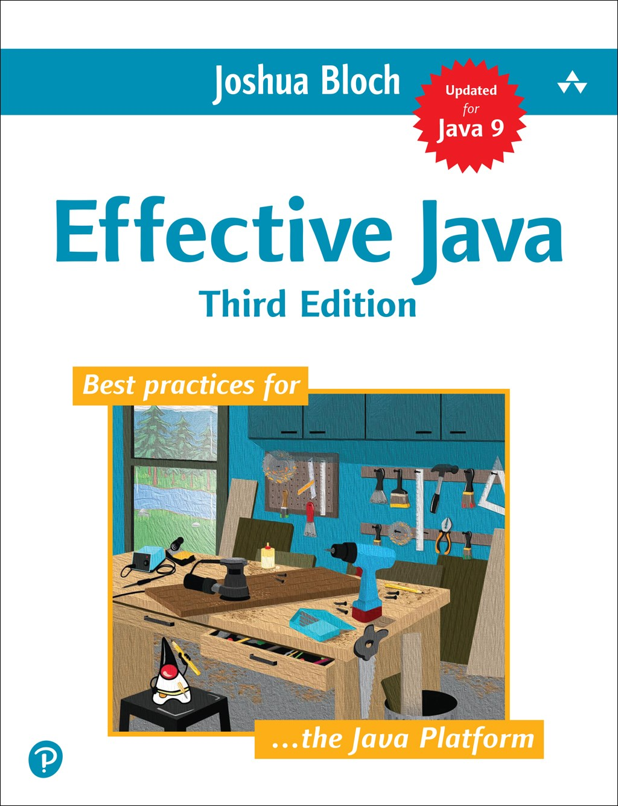

# Effective Java Third edition



```
Chapter 2 Creating and Destroying Objects
Item 1: Consider static factory methods instead of constructors
Item 2: Consider a builder when faced with many constructor parameters
Item 3: Enforce the singleton property with a private constructor or an enum type 
Item 4: Enforce noninstantiability with a private constructor
Item 5: Prefer dependency injection to hardwiring resources 
Item 6: Avoid creating unnecessary objects 
Item 7: Eliminate obsolete object references 
Item 8: Avoid finalizers and cleaners 
Item 9: Prefer try-with-resources to try-finally

Chapter 3 Methods Common to All Objects 
Item 10: Obey the general contract when overriding equals 
Item 11: Always override hashCode when you override equals 
Item 12: Always override toString 
Item 13: Override clone judiciously 
Item 14: Consider implementing Comparable 

Chapter 4 Classes and Interfaces 
Item 15: Minimize the accessibility of classes and members 
Item 16: In public classes, use accessor methods, not public fields 
Item 17: Minimize mutability 
Item 18: Favor composition over inheritance 
Item 19: Design and document for inheritance or else prohibit it 
Item 20: Prefer interfaces to abstract classes 
Item 21: Design interfaces for posterity 
Item 22: Use interfaces only to define types
Item 23: Prefer class hierarchies to tagged classes 
Item 24: Favor static member classes over nonstatic 
Item 25: Limit source files to a single top-level class 

Chapter 5 Generics
Item 26: Don’t use raw types 
Item 27: Eliminate unchecked warnings
Item 28: Prefer lists to arrays 
Item 29: Favor generic types
Item 30: Favor generic methods 
Item 31: Use bounded wildcards to increase API flexibility 
Item 32: Combine generics and varargs judiciously
Item 33: Consider typesafe heterogeneous containers 

Chapter 6 Enums and Annotations 
Item 34: Use enums instead of int constants
Item 35: Use instance fields instead of ordinals 
Item 36: Use EnumSet instead of bit fields 
Item 37: Use EnumMap instead of ordinal indexing
Item 38: Emulate extensible enums with interfaces 
Item 39: Prefer annotations to naming patterns 
Item 40: Consistently use the Override annotation
Item 41: Use marker interfaces to define types 

Chapter 7 Lambdas and Streams 
Item 42: Prefer lambdas to anonymous classes 
Item 43: Prefer method references to lambdas 
Item 44: Favor the use of standard functional interfaces 
Item 45: Use streams judiciously 
Item 46: Prefer side-effect-free functions in streams 
Item 47: Prefer Collection to Stream as a return type
Item 48: Use caution when making streams parallel 

Chapter 8 Methods
Item 49: Check parameters for validity 
Item 50: Make defensive copies when needed 
Item 51: Design method signatures carefully 
Item 52: Use overloading judiciously 
Item 53: Use varargs judiciously 
Item 54: Return empty collections or arrays, not nulls 
Item 55: Return optionals judiciously 
Item 56: Write doc comments for all exposed API elements 

Chapter 9 General Programming 
Item 57: Minimize the scope of local variables 
Item 58: Prefer for-each loops to traditional for loops 
Item 59: Know and use the libraries 
Item 60: Avoid float and double if exact answers are required 
Item 61: Prefer primitive types to boxed primitives 
Item 62: Avoid strings where other types are more appropriate 
Item 63: Beware the performance of string concatenation 
Item 64: Refer to objects by their interfaces 
Item 65: Prefer interfaces to reflection 
Item 66: Use native methods judiciously
Item 67: Optimize judiciously 
Item 68: Adhere to generally accepted naming conventions 

Chapter 10 Exceptions 
Item 69: Use exceptions only for exceptional conditions 
Item 70: Use checked exceptions for recoverable conditions and runtime exceptions for programming errors 
Item 71: Avoid unnecessary use of checked exceptions 
Item 72: Favor the use of standard exceptions
Item 73: Throw exceptions appropriate to the abstraction
Item 74: Document all exceptions thrown by each method
Item 75: Include failure-capture information in detail messages
Item 76: Strive for failure atomicity 
Item 77: Don’t ignore exceptions 

Chapter 11 Concurrency 
Item 78: Synchronize access to shared mutable data 
Item 79: Avoid excessive synchronization 
Item 80: Prefer executors, tasks, and streams to threads 
Item 81: Prefer concurrency utilities to wait and notify 
Item 82: Document thread safety 
Item 83: Use lazy initialization judiciously 
Item 84: Don’t depend on the thread scheduler 

Chapter 12 Serialization 
Item 85: Prefer alternatives to Java serialization 
Item 86: Implement Serializable with great caution 
Item 87: Consider using a custom serialized form 
Item 88: Write readObject methods defensively 
Item 89: For instance control, prefer enum types to readResolve 
Item 90: Consider serialization proxies instead of serialized instances 
``` 